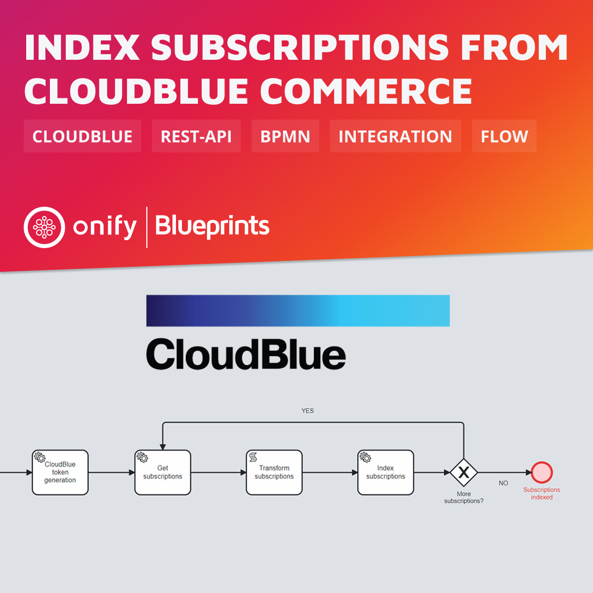

# Onify Blueprint: Index subscriptions from CloudBlue Commerce

## About 

### About CloudBlue

[CloudBlue](https://www.cloudblue.com) is a SaaS company that is helping businesses transform themselves, whatever their position in the supply chain. They provide a managed marketplace platform that takes the complexity out of distributing subscription- based solutions in the everything-as-a-service world.
[CloudBlue Commerce](https://www.cloudblue.com/commerce/) is multi-tier commerce platform that allows companies to build marketplaces.

> Also checkout https://github.com/cloudblue.

### About this Blueprint

In this Blueprint we index ALL subscriptions from CloudBlue Commerce via REST API. 

> Note: We do not index subscription or customer details. Feel free to add this feature to this Blueprint ;-)

## Requirements

* [Onify Hub](https://github.com/onify/install)
* [Camunda Modeler](https://camunda.com/download/modeler/)
* [CloudBlue Commerce](https://www.cloudblue.com/commerce/)

## Included

* 1 x Flow (BPMN)

## Setup

### CloudBlue Commerce

[Follow these instructions to get a API Subscription Key](https://kb.cloud.im/support/solutions/articles/66000489946-how-to-get-cloud-marketplace-api-subscription-key).

> For more information about the CloudBlue Commerce API, please see https://apidocs.cloud.im/1.8/howto/ready.

### Onify

Add the following settings in Onify.

|Key|Name|Value|Type|Tag|Role|Description|
|---|----|-----|----|---|----|-----------|
|cloudblue_baseurl|CloudBlue Base URL|`<BASEURL>`|string|cloudblue, frontend|admin|The Base URL for the API, eg. `https://api.cloud.im/marketplace/eu`|
|cloudblue_marketplace|CloudBlue Marketplace|`<MARKETPLACE>`|string|cloudblue, frontend|admin|The short name for the commercial marketplace, eg. `se`|
|cloudblue_subscriptionkey|CloudBlue Subscription Key|`<KEY>`|password|cloudblue, frontend|admin|Subscription to API services that contains certain limits on the API usage, for example, it defines the upper limit on the number of requests your system can send per a period of time. |
|cloudblue_username|CloudBlue Username|`<USERNAME>`|string|cloudblue, frontend|admin|Username is the login name to authenticate your system.|
|cloudblue_password|CloudBlue Password|`<PASSWORD>`|password|cloudblue, frontend|admin|Password for the user|

> Note: Creating settings via admin interface add a trailing `_` in key. This is required for flow to work.

## Deploy and run

1. Open the BPMN diagram in Camunda Modeler.
2. Deploy the BPMN diagram (click `Deploy current diagram` and follow the steps).
3. Run it (click `Start current diagram`).

## Support

* Community/forum: https://support.onify.co/discuss
* Documentation: https://support.onify.co/docs
* Support and SLA: https://support.onify.co/docs/get-support

## License

This project is licensed under the MIT License - see the [LICENSE](LICENSE) file for details.